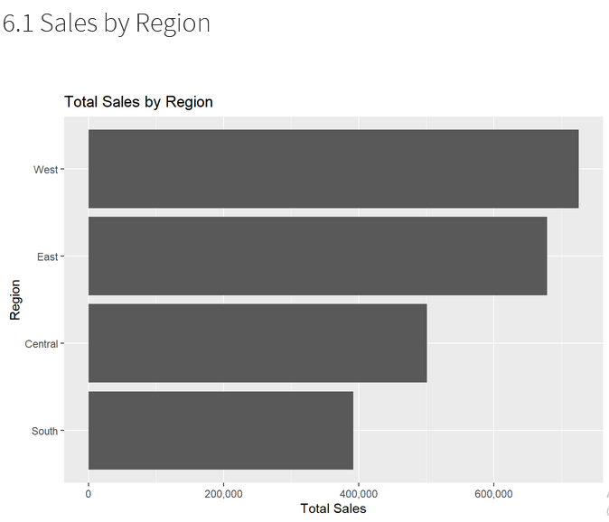
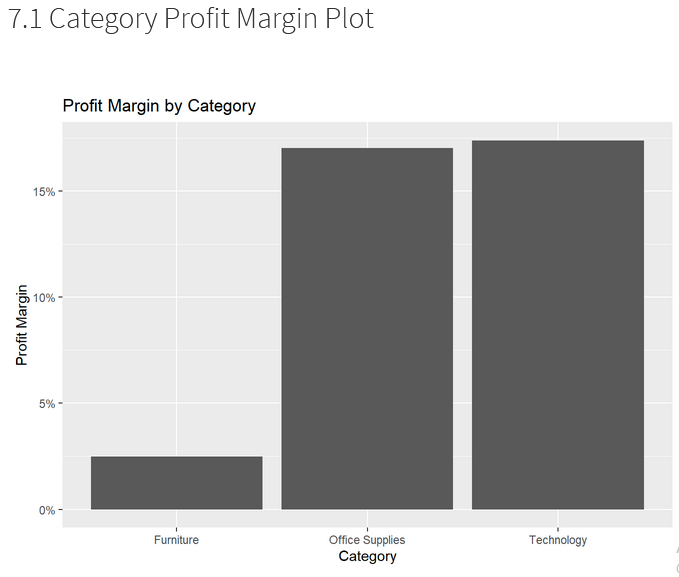

# 📊 Sales Performance & Profit Optimization Analysis (R Project)

---

## 📌 Project Overview
This project analyzes retail sales data to evaluate business performance and identify opportunities to improve profitability. The analysis focuses on sales trends, regional performance, customer segmentation, and the impact of discounts on profit.

---

## 📊 View Full Report
👉 [Click here to view the complete analysis](./sales_analysis.html)

---

## 🎯 Objectives
- Perform data cleaning and preprocessing  
- Calculate key business KPIs  
- Analyze regional sales performance  
- Evaluate profit margins across product categories  
- Segment customers based on sales contribution  
- Examine the relationship between discount and profit  

---

## 🧠 Skills Demonstrated
- Data Cleaning  
- Exploratory Data Analysis (EDA)  
- Data Visualization (ggplot2)  
- KPI Development  
- Business Insight Generation  

---

## 🛠️ Tools & Technologies
- R  
- R Markdown  
- tidyverse (dplyr, ggplot2)  
- lubridate  
- janitor  

---

## 📂 Dataset
- **Dataset**: Superstore Sales Data  
- **Source**: Kaggle  
- **Format**: CSV  

---

## 📊 Key Analysis Performed
- Data cleaning and transformation  
- KPI calculation (Total Sales, Profit, Profit Margin)  
- Regional sales comparison  
- Profit margin analysis by category  
- Customer segmentation analysis  
- Discount vs Profit relationship  

---

## 📈 Key Insights
- 📍 Sales performance varies significantly across regions  
- 📉 High discounts are associated with lower profitability  
- 📦 Certain product categories generate higher profit margins  
- 👥 Customer segments contribute differently to overall revenue  

---

## 💡 Business Recommendations
- Reduce excessive discounting to improve profit margins  
- Focus on expanding high-performing regions  
- Promote high-margin product categories  
- Develop targeted strategies for different customer segments  

---

## 📸 Sample Visualizations

*(Add screenshots here after uploading images)*

Example:

---
